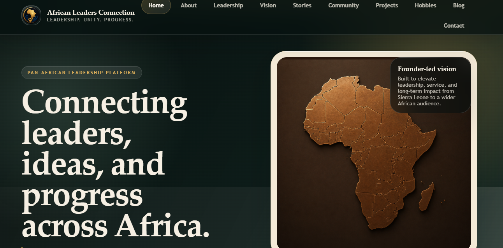

## 🌍 AFRICAN LEADERS CONNECTION

> **Leadership. Unity. Progress.**


---

## 🌐 Live Website

🔗 **Website:** https://alimuman10.github.io/african-leaders-connection/

---

## 🚀 Project Overview

**African Leaders Connection** is a professional Pan-African leadership platform designed to celebrate African excellence, principled leadership, purposeful service, and community progress.

The platform delivers a refined digital experience built around leadership storytelling, African identity, personal growth, community impact, and meaningful collaboration across emerging networks.

This project represents a professional leadership brand and digital platform, reflecting my identity as an **Ambassador of Leadership** and my commitment to advancing transformation across Africa and beyond.

---

## 🎯 Mission

To inspire, educate, and connect people through leadership-driven content, African success stories, and values rooted in service, responsibility, and progress.

---

## 🌍 Vision

To grow **African Leaders Connection** into a global Pan-African leadership platform that:

- Celebrates African leaders and changemakers  
- Empowers young people and emerging professionals  
- Promotes leadership excellence across Africa and beyond  
- Encourages service, innovation, and collaboration  
- Builds a trusted digital ecosystem for African leadership  

---

## 🖼️ Project Preview



---

## ✨ Key Features

- Premium Pan-African leadership homepage  
- Professionally designed hero section with African-inspired branding  
- Multi-page platform architecture  
- Clean and structured navigation system  
- Sections for leadership, vision, stories, community, and projects  
- Personal leadership branding and identity  
- Modern color system (dark green, bronze, cream, and gold)  
- Responsive layout foundation  
- Contact and collaboration access  
- Elegant, minimal, and professional UI  

---

## 📄 Pages Included

| Page | Description |
|------|-------------|
| `index.html` | Homepage and main platform introduction |
| `about.html` | Platform and founder background |
| `leadership.html` | Leadership philosophy and values |
| `vision.html` | Mission and long-term strategic direction |
| `stories.html` | African leadership and success narratives |
| `community.html` | Community engagement and collaboration |
| `projects.html` | Leadership and development projects |
| `hobbies.html` | Personal growth and professional interests |
| `blog.html` | Articles, insights, and leadership reflections |
| `contact.html` | Contact and collaboration details |

---

## 🛠️ Technologies Used

- HTML5  
- CSS3  
- Responsive Web Design  
- GitHub Pages  

---

## 📁 Project Structure

```bash
african-leaders-connection/
│
├── index.html              # Homepage and main platform landing page
├── about.html              # About the platform and founder background
├── leadership.html         # Leadership philosophy and values
├── vision.html             # Mission and long-term direction
├── stories.html            # African leadership narratives
├── community.html          # Community engagement and collaboration
├── projects.html           # Leadership and development projects
├── hobbies.html            # Personal development and interests
├── blog.html               # Blog and leadership insights
├── contact.html            # Contact information
│
├── styles.css              # Main stylesheet and responsive design
│
├── profile.jpg             # Founder profile image
├── screenshort2.png        # Updated homepage preview image
│
├── README.md               # Project documentation
└── LICENSE                 # MIT License
````

---

## 👤 Author

**Alimu Mansaray**

📧 Email: [mansarayalimu903@gmail.com](mailto:mansarayalimu903@gmail.com)
📞 Phone: +23279101090
🌍 Location: Sierra Leone

---

## 🤝 Collaboration

I am open to:

* Leadership discussions
* Blog and content collaborations
* Web development opportunities
* Digital branding and platform development
* Community leadership partnerships
* African storytelling and innovation initiatives

---

## 🚀 Future Improvements

Planned upgrades include:

* Expanding leadership blog content
* Enhancing mobile responsiveness across all pages
* Adding more African leadership stories
* Building a full blog publishing system
* Transitioning to a React-based frontend
* Integrating backend systems (Laravel / Node.js)
* Adding authentication and user engagement features
* Developing a full African leadership community platform

---

## ⭐ Support

If you find this project valuable:

* ⭐ Star the repository
* 🔁 Share with your network
* 👤 Follow for future updates
* 🌍 Support African leadership and innovation

---

## 📜 License

This project is licensed under the **MIT License**.

For full details, see the [LICENSE](LICENSE) file.

---

## 📢 Final Statement

**African Leaders Connection** is more than a website — it is a growing vision to connect leaders, inspire purpose, and promote African progress on a global stage.

> **Leadership. Unity. Progress.**
