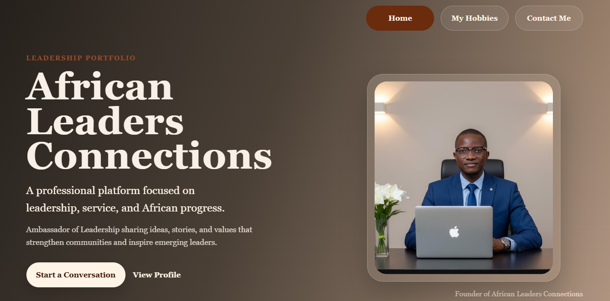

## 🌍 AFRICAN LEADERS CONNECTION

> **Leadership. Unity. Progress.**


---

## 🌐 Live Website

🔗 https://alimuman10.github.io/african-leaders-connection/

---

## 🚀 Project Overview

**African Leaders Connection** is a professional leadership portfolio and blog-style platform created to celebrate African leadership, service, excellence, and progress.

This project was developed as a capstone portfolio website and redesigned to represent my identity as an **Ambassador of Leadership**.

The platform focuses on:
- Leadership storytelling  
- African success narratives  
- Personal growth and development  
- Community impact and transformation  

---

## 🎯 Mission

To create a digital platform that inspires, educates, and connects people through leadership-focused content, African success stories, and values that promote unity, responsibility, and progress.

---

## 🌍 Vision

To grow **African Leaders Connection** into a global leadership platform that:
- Celebrates African leaders  
- Empowers young people  
- Promotes leadership excellence across Africa and beyond  

---

## 🖼️ Project Preview



---

## ✨ Key Features

- Professional leadership portfolio homepage  
- Multi-page website structure  
- Navigation system (Home, Hobbies, Contact)  
- Personal leadership branding  
- Clean and modern UI design  
- Fully responsive layout foundation  
- Contact and collaboration access  

---

## 📄 Pages Included

| Page | Description |
|------|------------|
| `index.html` | Homepage and leadership profile |
| `hobbies.html` | Professional interests and personal development |
| `contact.html` | Contact information and collaboration details |

---

## 🛠️ Technologies Used

- HTML5  
- CSS3  

---

## 📁 Project Structure

```bash
african-leaders-connection/
│
├── index.html
├── hobbies.html
├── contact.html
├── styles.css
├── profile.jpg
├── screenshot.png
├── README.md
└── LICENSE
````

---

## 👤 Author

**Alimu Mansaray**

📧 Email: [mansarayalimu903@gmail.com](mailto:mansarayalimu903@gmail.com)
📞 Phone: +23279101090
🌍 Location: Sierra Leone

---

## 🤝 Collaboration

I am open to:

* Leadership discussions
* Blog collaborations
* Web development opportunities
* Digital branding projects
* Community leadership partnerships
* African leadership storytelling

---

## 🚀 Future Improvements

Planned upgrades include:

* Expanding leadership blog content
* Improving mobile responsiveness
* Building a full blog system
* Converting into a React-based application
* Integrating a backend (Laravel / Node.js)
* Developing a full African leadership community platform

---

## ⭐ Support

If you find this project valuable:

* ⭐ Star the repository
* 🔁 Share with your network
* 👤 Follow for future updates

---

## 📜 License

This project is licensed under the MIT License. See the `LICENSE` file for details.

---

## 📢 Final Statement

**African Leaders Connection** represents a vision to celebrate leadership, inspire transformation, and promote African excellence globally.

> **Leadership. Unity. Progress.**
